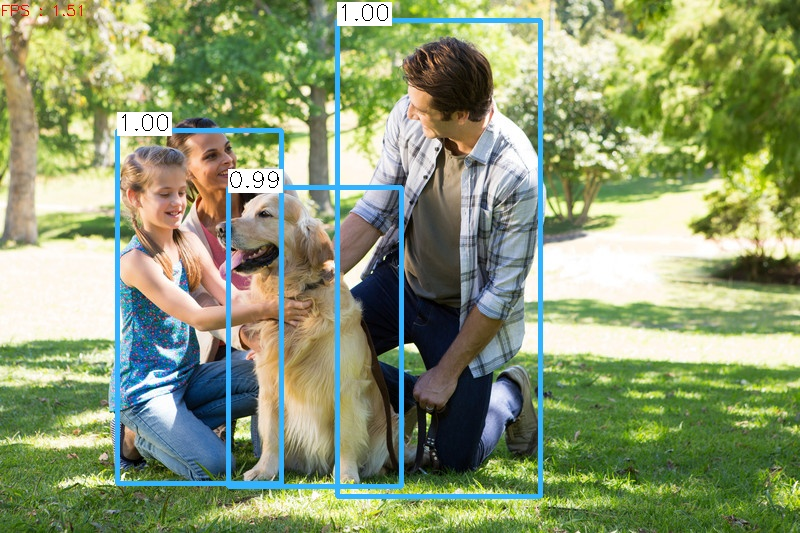
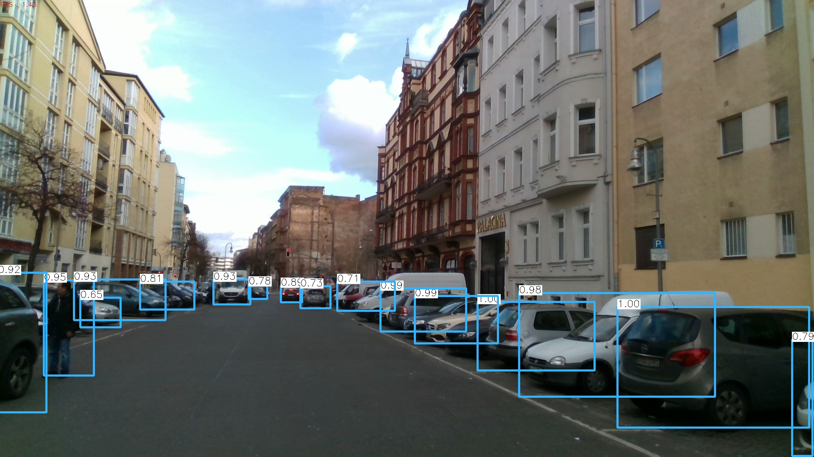

# CPPND: Capstone Project 

## YOLOv3 Deployment with OpenCV using C++
This is the capstone project for the Udacity C++ Nanodegree Program. YOLO Object detection model using OpenCV is implemented. The program reads an image file given by the user and then performs object detection on it.The output image is displayed with bounding boxes over the detected objects and is also saved into the images folder. This program is  built using the concepts learnt in the nanodegree program. It can also be used for various Deep Neural Network Models.The compiled file is executed through the command line and takes in various options (image / video) as input parameters.

## Dependencies for Running Locally
* cmake >= 3.7
  * All OSes: [click here for installation instructions](https://cmake.org/install/)
* make >= 4.1 (Linux, Mac), 3.81 (Windows)
  * Linux: make is installed by default on most Linux distros
  * Mac: [install Xcode command line tools to get make](https://developer.apple.com/xcode/features/)
  * Windows: [Click here for installation instructions](http://gnuwin32.sourceforge.net/packages/make.htm)
* OpenCv >=4.1
  * For Installation [here](https://docs.opencv.org/trunk/d7/d9f/tutorial_linux_install.html)    
* gcc/g++ >= 5.4
  * Linux: gcc / g++ is installed by default on most Linux distros
  * Mac: same deal as make - [install Xcode command line tools](https://developer.apple.com/xcode/features/)
  * Windows: recommend using [MinGW](http://www.mingw.org/)
 
## Basic Build Instructions

1. Clone this repo.
2. Enter into yolo_model directory. `cd yolo_model`
3. `sudo chmod a+x get_models.sh`
4. `./get_models.sh`
5. Make a build directory in the top level directory: `mkdir build && cd build`
6. Compile: `cmake .. && make`
7. Run it: `./yolo --image=../images/test_image.jpg`
8. If you want to change model parameters Run `./yolo --image=../images/test_image.jpg --conf=0.6 --nms=0.5`
9. You can also give video as input `./yolo --video=path to video file`

## Example of a Realtime Image from webcam stream

 `./yolo --image=../images/image_stream_0001.jpg --conf=0.6 --nms=0.5`

## Rubric

__README (All Rubric Points REQUIRED)__

|DONE | CRITERIA | MEETS SPECIFICATIONS| WHERE |
|-- | -- | --| -- |
| :heavy_check_mark: | A README with instructions is included with the project |The README is included with the project and has instructions for building/running the project. If any additional libraries are needed to run the project, these are indicated with cross-platform installation instructions. You can submit your writeup as markdown or pdf.| |
| :heavy_check_mark: | The README indicates which project is chosen. | The README describes the project you have built. The README also indicates the file and class structure, along with the expected behavior or output of the program. | |
| :heavy_check_mark: | The README includes information about each rubric point addressed. | The README indicates which rubric points are addressed. The README also indicates where in the code (i.e. files and line numbers) that the rubric points are addressed. | |

__Compiling and Testing (All Rubric Points REQUIRED)__

|DONE | CRITERIA | MEETS SPECIFICATIONS| WHERE |
|-- | -- | --| -- |
| :heavy_check_mark: | The submission must compile and run. | The project code must compile and run without errors. We strongly recommend using cmake and make, as provided in the starter repos. If you choose another build system, the code must compile on any reviewer platform. |

__Loops, Functions, I/O__

|DONE | CRITERIA | MEETS SPECIFICATIONS| WHERE |
|-- | -- | --| -- |
| :heavy_check_mark: | The project demonstrates an understanding of C++ functions and control structures.| A variety of control structures are used in the project. The project code is clearly organized into functions.| All *.cpp files |
| :heavy_check_mark: | The project reads data from a file and process the data, or the program writes data to a file. | The project reads data from an external file or writes data to a file as part of the necessary operation of the program.| input.cpp file contains functions that read, write and display data  |
| :heavy_check_mark: | The project accepts user input and processes the input.|The project accepts input from a user as part of the necessary operation of the program.|  The executable file accepts user inputs as shown in example above |

__Object Oriented Programming__

|DONE | CRITERIA | MEETS SPECIFICATIONS| WHERE |
|-- | -- | --| -- |
| :heavy_check_mark: | The project uses Object Oriented Programming techniques. | The project code is organized into classes with class attributes to hold the data, and class methods to perform tasks. | All *.cpp and *.h files |
| :heavy_check_mark: | Classes use appropriate access specifiers for class members. | All class data members are explicitly specified as public, protected, or private.| All *.cpp and *.h files |
| :heavy_check_mark: | Class constructors utilize member initialization lists. | All class members that are set to argument values are initialized through member initialization lists.| All *.cpp and *.h files |
| :heavy_check_mark: | Classes abstract implementation details from their interfaces. | All class member functions document their effects, either through function names, comments, or formal documentation. Member functions do not change program state in undocumented ways.| All *.cpp and *.h files |
| :heavy_check_mark: | Classes encapsulate behavior. | Appropriate data and functions are grouped into classes. Member data that is subject to an invariant is hidden from the user. State is accessed via member functions.| All *.cpp and *.h files |
| :heavy_check_mark: | Classes follow an appropriate inheritance hierarchy. | Inheritance hierarchies are logical. Composition is used instead of inheritance when appropriate. Abstract classes are composed of pure virtual functions. Override functions are specified.| utils.h has class YOLO inheriting utility functions from UTIL class  |
|  | Overloaded functions allow the same function to operate on different parameters. |  |
|  | Derived class functions override virtual base class functions. |One member function in an inherited class overrides a virtual base class member function.| |
| :heavy_check_mark: | Templates generalize functions in the project. | One function is declared with a template that allows it to accept a generic parameter.| |

__Memory Management__

|DONE | CRITERIA | MEETS SPECIFICATIONS| WHERE |
|-- | -- | --| -- |
| :heavy_check_mark: | The project makes use of references in function declarations. | At least two variables are defined as references, or two functions use pass-by-reference in the project code.|Multiple functions in input.h and utils.h |
| :heavy_check_mark: | The project uses destructors appropriately. | At least one class that uses unmanaged dynamically allocated memory, along with any class that otherwise needs to modify state upon the termination of an object, uses a destructor. | input.h for class Input|
|  | The project uses scope / Resource Acquisition Is Initialization (RAII) where appropriate. | The project follows the Resource Acquisition Is Initialization pattern where appropriate, by allocating objects at compile-time, initializing objects when they are declared, and utilizing scope to ensure their automatic destruction.| |
| :heavy_check_mark: | The project follows the Rule of 5. | For all classes, if any one of the copy constructor, copy assignment operator, move constructor, move assignment operator, and destructor are defined, then all of these functions are defined.| Followed in utils.h |
| :heavy_check_mark: | The project uses move semantics to move data, instead of copying it, where possible. | For classes with move constructors, the project returns objects of that class by value, and relies on the move constructor, instead of copying the object. | Done in utils.cpp |
| :heavy_check_mark: | The project uses smart pointers instead of raw pointers. | The project uses at least one smart pointer: unique_ptr, shared_ptr, or weak_ptr. The project does not use raw pointers.| used in main function |
